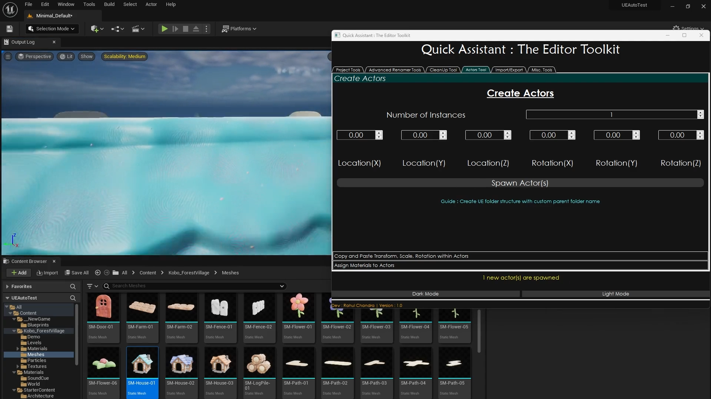
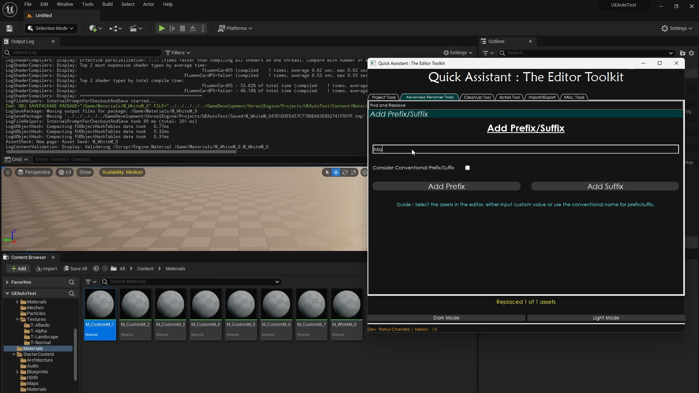
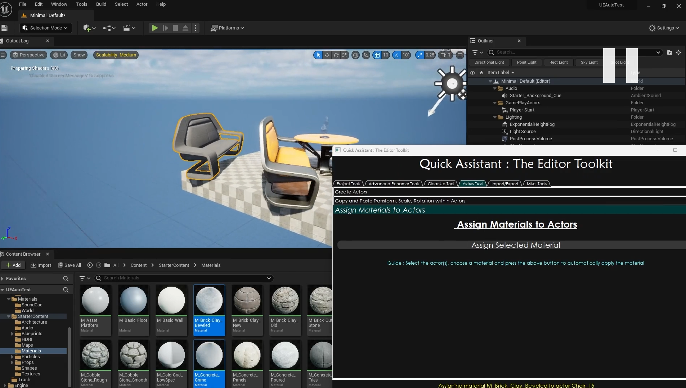
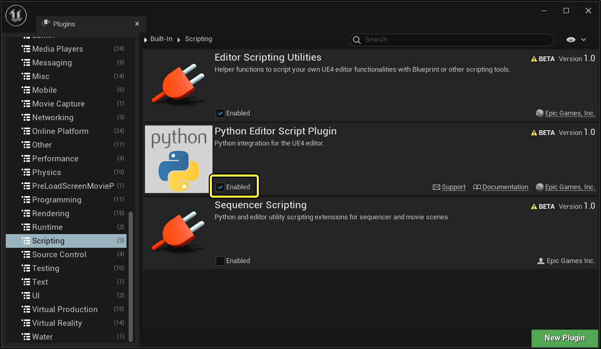
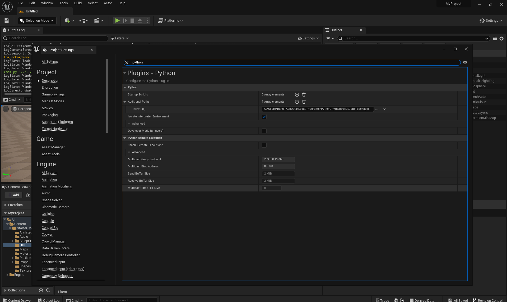
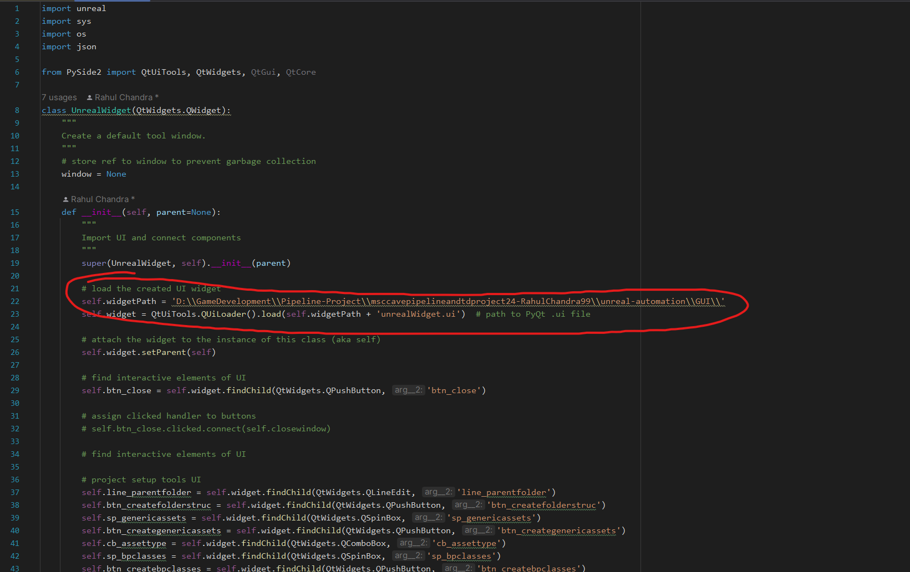
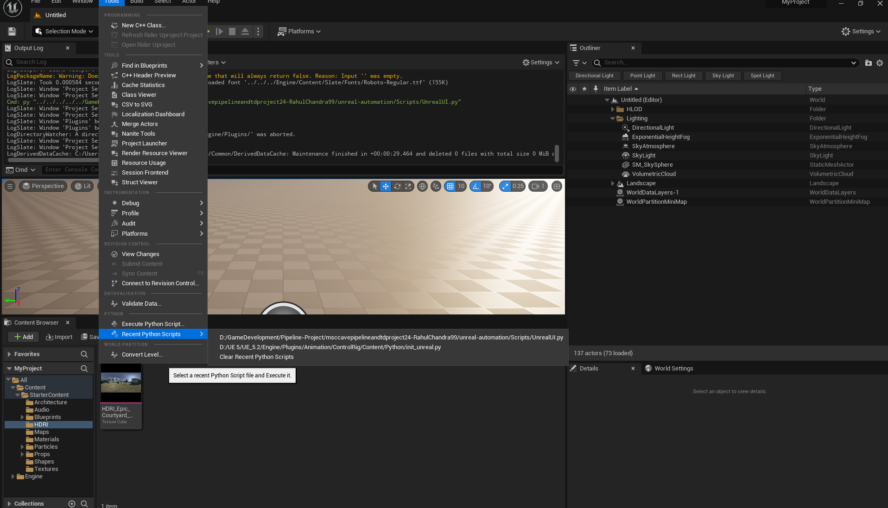

# Quick Assistant : Editor Toolkit (An Unreal Automation Tool)

## Table of Contents
1. [Introduction](#introduction)
2. [Result](#result-video)
3. [Tool Elements](#tool-elements)
4. [Installation & Build](#installation--build)
    - [Setting up Python in Unreal Engine](#setting-up-python-in-unreal-engine)
5. [How to Use](#how-to-use)
6. [References](#references)

## Introduction

Quick Assistant empowers developers with a suite of time-saving tools and 
workflow improvements within the unreal editor. 
The flexible Quick Assistant Window integrates seamlessly 
alongside the unreal engine editor, providing convenient access to 
essential functions.

This Python automation tool for Unreal Engine aims to streamline various aspects of game 
development, including asset organization, actor placement, and scene cleanup.

Multiple functions within unreal engine can be implemented using this widget with the click
of a button.The tool offers benefits such as increased efficiency, consistency
in asset management and scene setup, and reduced errors through automation 
of repetitive tasks. 

Overall, it empowers developers to focus more on creative aspects of game 
development by minimizing manual administrative efforts.

> Supported Platforms : Windows, Mac
> 
> Requirements : PySide2 , Python 3.9.7(preferred)
> 
> Supported Engine Versions : *Unreal 5.0 and above*
>
> Tool is originally created using UE 5.2.1

## [Result Video](https://www.youtube.com/watch?v=WPzAcpBbWoc&ab_channel=RahulChandra)
 
 
 

## Tool Elements

- Create Folder Structure
- Create multiple generic assets
- Create multiple Blueprint Classes
- Duplicate Assets
- Rename Assets
- Add Prefix and Suffix
- Organise Actors and Assets
- Remove unused assets
- Delete empty folders
- Create multiple actors
- Copy & Paste transforms within actors
- Assign materials to multiple actors
- Import Multiple Assets 
- Export Multiple Assets
- Create Multiple Material Instances

## Installation & Build

### Setting up Python in Unreal Engine
  
(I just used the same instruction from the referenced documentation for this part. [Reference](https://dev.epicgames.com/documentation/en-us/unreal-engine/scripting-the-unreal-editor-using-python?application_version=5.3)

Note: Must enable the plugin separately for each Project

To run the tool : 
- Open your Project, and choose Edit > Plugins from the main menu.
- In the Plugins window, go to the Scripting section.
- Find the Python Editor Script Plugin in the right-hand panel, and check its Enabled box.

- Restart the editor
- Install PySide2 alongside python version installed in your system(3.9.7 python version recommended)
- Choose Edit > Project Settings > search python 
- Enable Isolate Interpreter Environment
- In Additional Paths add the location of python lib. Eg : C:/Users/[user_name]/AppData/Local/Programs/Python/Python39/Lib/site-packages to add location of PySide2
 
- <I><B>IMPORTANT STEP</B></I> : In the UnrealUI.py file , in self.widgetpath , set the location of the GUI folder like shown below
 
- Choose Tools > Execute Python Script > Choose UnrealUI python script
 

### How to Use

Checkout the [video tutorial](https://www.youtube.com/watch?v=WPzAcpBbWoc&ab_channel=RahulChandra)

## References

- Unreal Engine. Editor Tools, UE Marketplace. Available at: [https://www.unrealengine.com/marketplace/en-US/product/editor-tools-and-quaility-of-life-extension](https://www.unrealengine.com/marketplace/en-US/product/editor-tools-and-quaility-of-life-extension)
- Unreal Engine. Level Design Tools, UE Marketplace. Available at: [https://www.unrealengine.com/marketplace/en-US/product/editor-tools-and-quaility-of-life-extension](https://www.unrealengine.com/marketplace/en-US/product/level-design-tools)
